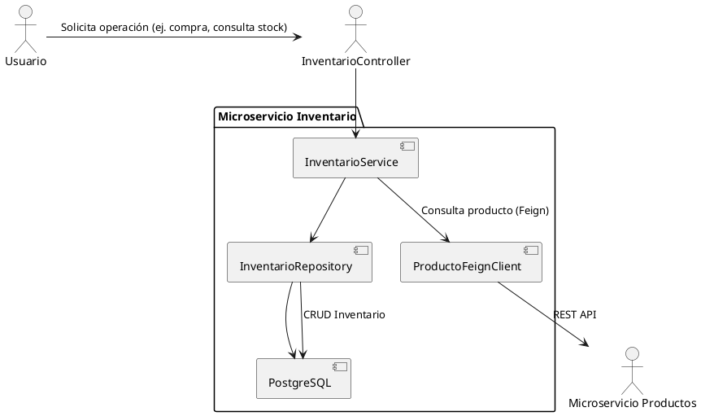

# Microservicio Inventario

Este proyecto es un microservicio desarrollado en Spring Boot para la gestión de inventario de productos. Permite consultar, actualizar y reducir el stock de productos, así como integrarse con otros microservicios mediante Feign Client.

## Tabla de Contenidos
- [Descripción General](#descripción-general)
- [Arquitectura](#arquitectura)
- [Tecnologías Utilizadas](#tecnologías-utilizadas)
- [Requisitos Previos](#requisitos-previos)
- [Configuración](#configuración)
- [Ejecución](#ejecución)
- [Endpoints Principales](#endpoints-principales)
- [Pruebas](#pruebas)
- [Docker](#docker)
- [Swagger / OpenAPI](#swagger--openapi)
- [Estructura del Proyecto](#estructura-del-proyecto)
- [Autor](#autor)

## Descripción General

El microservicio Inventario gestiona el stock de productos y el proceso de compra. Se comunica con el microservicio de productos para obtener información adicional y asegura la integridad del inventario durante las operaciones de compra y actualización.


## Arquitectura
El microservicio sigue una arquitectura basada en capas y se integra con otros servicios mediante Feign Client, siguiendo principios de arquitectura de microservicios.
- **Controller:** Expone los endpoints REST y gestiona las solicitudes HTTP provenientes de los clientes.
- **Service:** Contiene la lógica de negocio principal y orquesta las operaciones entre las distintas capas.
- **Repository:** Se encarga del acceso y la persistencia de datos en la base de datos.
- **Client (Feign):** Permite la comunicación con otros microservicios a través de clientes declarativos.

### Diagrama de Arquitectura (PlantUML)



## Tecnologías Utilizadas
- Java 17
- Spring Boot
- Spring Data JPA
- PostgreSQL
- Feign Client
- Springdoc OpenAPI (Swagger)
- Docker
- Maven

## Requisitos Previos
- Java 17 o superior
- Maven 3.8+
- PostgreSQL
- Docker (opcional)

## Configuración

Edita el archivo `src/main/resources/application.properties` para configurar la conexión a la base de datos y otros parámetros necesarios, como la URL y API Key del microservicio de productos.

## Ejecución

Para compilar y ejecutar el proyecto localmente:

```powershell
./mvn spring-boot:run
```

O bien, para construir el JAR y ejecutarlo:

```powershell
./mvn clean package
java -jar target/Inventario-0.0.1-SNAPSHOT.jar
```

## Endpoints Principales

- `GET /api/inventario/{productoId}`: Consulta inventario y detalles del producto.
- `POST /api/inventario/inicializar`: Inicializa inventario para un producto.
- `PUT /api/inventario/{productoId}/cantidad`: Actualiza la cantidad de inventario.
- `POST /api/inventario/comprar`: Realiza una compra y reduce el stock.

## Pruebas

Para ejecutar las pruebas unitarias:

```powershell
./mvnw test
```

## Docker

El proyecto incluye un `Dockerfile` para facilitar el despliegue en contenedores. Para construir y ejecutar la imagen:

```powershell
docker build -t inventario-service .
docker run -p 8081:8081 inventario-service
```

## Swagger / OpenAPI

La documentación interactiva de la API está disponible en:

- [http://localhost:8081/swagger-ui.html](http://localhost:8081/swagger-ui.html)

Si tienes problemas para acceder, revisa la configuración de dependencias y seguridad.

## Estructura del Proyecto

```
Inventario/
├── Dockerfile
├── pom.xml
├── src/
│   ├── main/
│   │   ├── java/com/example/Inventario/
│   │   │   ├── controller/
│   │   │   ├── service/
│   │   │   ├── repository/
│   │   │   ├── client/
│   │   │   ├── config/
│   │   │   ├── dto/
│   │   │   ├── event/
│   │   │   ├── exception/
│   │   │   ├── handler/
│   │   │   ├── model/
│   │   │   └── security/
│   │   └── resources/
│   │       └── application.properties
│   └── test/
│       └── java/com/example/Inventario/
│           └── service/
└── target/
```

## Autor

Desarrollado por Anderson para LinkTic.
