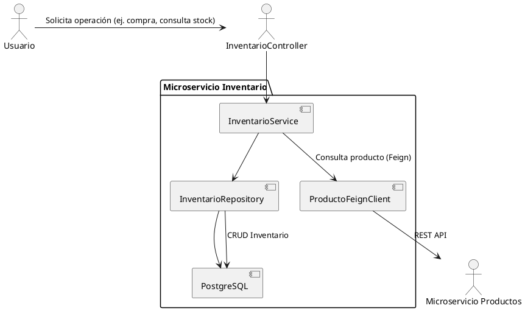

# Microservicio Inventario

Este proyecto es un microservicio desarrollado en Spring Boot para la gestión de inventario de productos. Permite consultar, actualizar y reducir el stock de productos, así como integrarse con otros microservicios mediante Feign Client. Incluye seguridad basada en API Key, manejo centralizado de excepciones y eventos de dominio para notificar cambios en el inventario.

## Tabla de Contenidos
- [Descripción General](#descripción-general)
- [Arquitectura](#arquitectura)
- [Diagrama de Interacción entre Servicios](#diagrama-de-interacción-entre-servicios)
- [Decisiones Técnicas y Justificaciones](#decisiones-técnicas-y-justificaciones)
- [Explicación del Flujo de Compra](#explicación-del-flujo-de-compra)
- [Tecnologías Utilizadas](#tecnologías-utilizadas)
- [Requisitos Previos](#requisitos-previos)
- [Instalación y Ejecución](#instalación-y-ejecución)
- [Seguridad y API Key](#seguridad-y-api-key)
- [Manejo de Errores](#manejo-de-errores)
- [Eventos de Dominio](#eventos-de-dominio)
- [Endpoints Principales](#endpoints-principales)
- [Pruebas](#pruebas)
- [Docker](#docker)
- [Swagger / OpenAPI](#swagger--openapi)
- [Estructura del Proyecto](#estructura-del-proyecto)
- [Uso de Herramientas de IA en el Desarrollo](#uso-de-herramientas-de-ia-en-el-desarrollo)
- [Autor](#autor)

## Descripción General

El microservicio Inventario gestiona el stock de productos y el proceso de compra. Se comunica con el microservicio de productos para obtener información adicional y asegura la integridad del inventario durante las operaciones de compra y actualización. Incluye mecanismos de seguridad, manejo de errores y eventos para una arquitectura robusta y desacoplada.

## Arquitectura

El microservicio sigue una arquitectura basada en capas y se integra con otros servicios mediante Feign Client, siguiendo principios de arquitectura de microservicios.

- **Controller:** Expone los endpoints REST y gestiona las solicitudes HTTP provenientes de los clientes.
- **Service:** Contiene la lógica de negocio principal y orquesta las operaciones entre las distintas capas.
- **Repository:** Se encarga del acceso y la persistencia de datos en la base de datos.
- **Client (Feign):** Permite la comunicación con otros microservicios a través de clientes declarativos.
- **Config:** Configuración de seguridad, Feign y políticas de reintentos.
- **Event:** Publicación y escucha de eventos de dominio relacionados con el inventario.
- **Handler:** Manejo centralizado de excepciones.

## Diagrama de Interacción entre Servicios



## Decisiones Técnicas y Justificaciones

- **Base de datos:** Se eligió PostgreSQL por su soporte a transacciones ACID, integridad referencial, consultas complejas y robustez empresarial. SQLite es más adecuado para aplicaciones pequeñas y NoSQL para datos no estructurados, pero ninguna de estas opciones ofrece la consistencia y seguridad necesarias para un sistema de inventario crítico.
- **Lógica de compra:** El endpoint de compra se implementó en el microservicio de inventario y no en el de productos para garantizar la responsabilidad única. El inventario es el único responsable de validar y modificar el stock, mientras que productos solo expone información de catálogo. Esto sigue los principios de Domain-Driven Design y facilita la mantenibilidad y escalabilidad.

## Explicación del Flujo de Compra

1. El usuario solicita una compra a través del endpoint de inventario.
2. El servicio de inventario consulta el microservicio de productos para validar la existencia y obtener información del producto.
3. Se valida la existencia de inventario y la disponibilidad de stock.
4. Si hay stock suficiente, se descuenta la cantidad comprada y se actualiza el inventario.
5. Se emite un evento de dominio (`InventarioActualizadoEvent`) para notificar el cambio de stock.
6. Se retorna una respuesta con los detalles de la compra.

Este flujo asegura la integridad del stock y desacopla la lógica de negocio entre los microservicios.

## Tecnologías Utilizadas

- Java 17
- Spring Boot
- Spring Data JPA
- PostgreSQL
- Feign Client (con configuración personalizada de reintentos y manejo de errores)
- Springdoc OpenAPI (Swagger)
- Spring Security (API Key)
- Docker
- Maven

## Requisitos Previos

- Java 17 o superior
- Maven 3.8+
- PostgreSQL
- Docker (opcional)

## Instalación y Ejecución

1. Clona el repositorio y accede al directorio del proyecto.
2. Configura la base de datos y las variables necesarias en `src/main/resources/application.properties`.
3. Para compilar y ejecutar localmente:

```powershell
./mvn spring-boot:run
```

O bien, para construir el JAR y ejecutarlo:

```powershell
./mvn clean package
java -jar target/Inventario-0.0.1-SNAPSHOT.jar
```

## Seguridad y API Key

El microservicio protege sus endpoints mediante autenticación por API Key. Debes incluir el header `X-API-KEY` en cada petición a los endpoints protegidos.

### Ejemplo de petición con API Key

```http
GET /api/inventario HTTP/1.1
Host: localhost:8081
X-API-KEY: inventario_secreta_54321
```

- Los endpoints de Swagger y documentación están abiertos para facilitar la exploración de la API.
- La configuración de seguridad se encuentra en la clase `SecurityConfig`, que define la política stateless y el filtro de autenticación por API Key.

## Manejo de Errores

El manejo de errores es centralizado mediante la clase `GlobalExceptionHandler`, que captura y responde con mensajes claros y estructurados para:

- Producto no encontrado (`ProductoNotFoundException`)
- Inventario no encontrado (`InventarioNotFoundException`)
- Stock insuficiente (`StockNotAvailableException`)
- Errores inesperados

Cada error devuelve un JSON con detalles como timestamp, status, error, message y path.

## Eventos de Dominio

El microservicio publica eventos (`InventarioActualizadoEvent`) cada vez que el inventario de un producto es actualizado o una compra es realizada. Estos eventos pueden ser escuchados por otros componentes o servicios para realizar acciones adicionales.

## Endpoints Principales

- `GET /api/inventario/{productoId}`: Consulta inventario y detalles del producto.
- `POST /api/inventario/inicializar`: Inicializa inventario para un producto.
- `PUT /api/inventario/{productoId}/cantidad`: Actualiza la cantidad de inventario.
- `POST /api/inventario/comprar`: Realiza una compra y reduce el stock.

## Pruebas

Para ejecutar las pruebas unitarias:

```powershell
./mvn test
```

## Docker

Para construir y ejecutar el microservicio junto con su base de datos usando Docker Compose:

1. Asegúrate de tener el archivo `docker-compose.yml` en el directorio raíz (fuera de la carpeta del proyecto `inventario-service`).
2. Ejecuta el siguiente comando desde la ubicación del archivo `docker-compose.yml`:
   ```sh
   docker-compose up --build -d
   ```
   Esto levantará:
   - Una base de datos PostgreSQL para inventario (`db_inventario`)
   - El microservicio de inventario (`inventario-service`)

3. Para detener y eliminar los contenedores, ejecuta:
   ```sh
   docker-compose down
   ```

## Swagger / OpenAPI

La documentación interactiva de la API está disponible en:

- [http://localhost:8081/swagger-ui.html](http://localhost:8081/swagger-ui.html)

Si tienes problemas para acceder, revisa la configuración de dependencias y seguridad.

## Estructura del Proyecto

```
Inventario/
├── Dockerfile
├── pom.xml
├── src/
│   ├── main/
│   │   ├── java/com/example/Inventario/
│   │   │   ├── controller/
│   │   │   ├── service/
│   │   │   ├── repository/
│   │   │   ├── client/
│   │   │   ├── config/
│   │   │   ├── dto/
│   │   │   ├── event/
│   │   │   ├── exception/
│   │   │   ├── handler/
│   │   │   ├── model/
│   │   │   └── security/
│   │   └── resources/
│   │       └── application.properties
│   └── test/
│       └── java/com/example/Inventario/
│           └── service/
└── target/
```

## Uso de Herramientas de IA en el Desarrollo

Durante el desarrollo de este microservicio se utilizaron herramientas de Inteligencia Artificial, como GitHub Copilot para:

- Generar documentación de clases y métodos de forma automática y consistente.
- Sugerir fragmentos de código para controladores, servicios y manejo de excepciones.
- Proponer ejemplos de configuración de seguridad y Feign Client.
- Mejorar la redacción y estructura del README.md.

La calidad del código generado por IA fue verificada mediante:
- Revisión manual y validación de buenas prácticas de Java y Spring Boot.
- Ejecución de pruebas unitarias y de integración.
- Validación de la documentación generada y su coherencia con la lógica implementada.

## Autor

Anderson Ramirez Alejo  
anderson.ramirez@linktic.com
